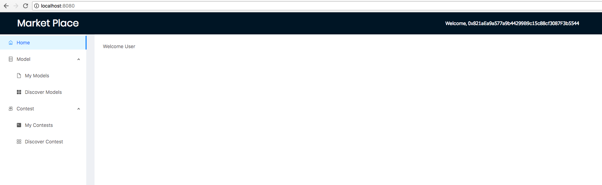
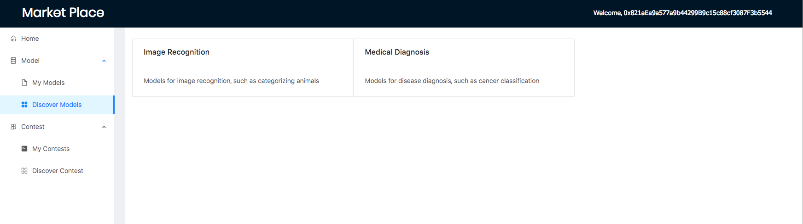
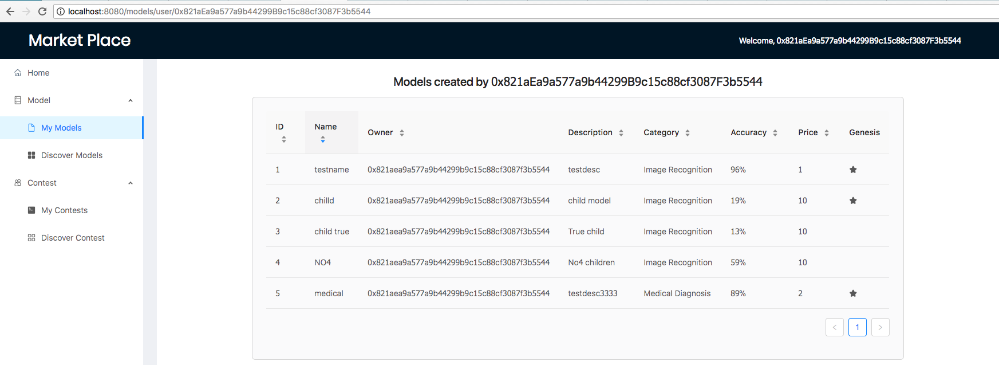
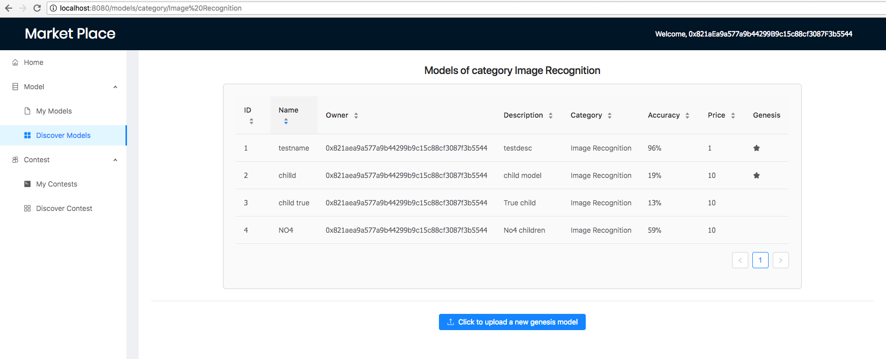
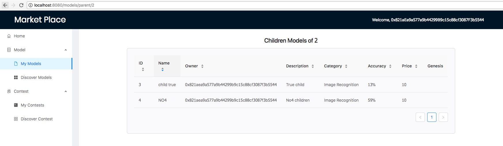
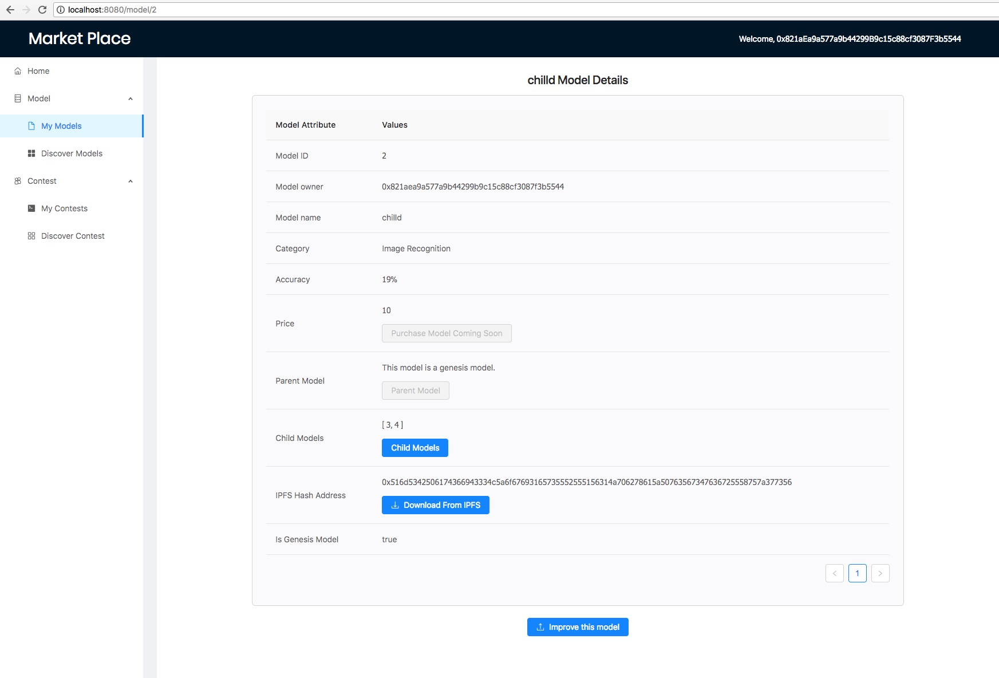
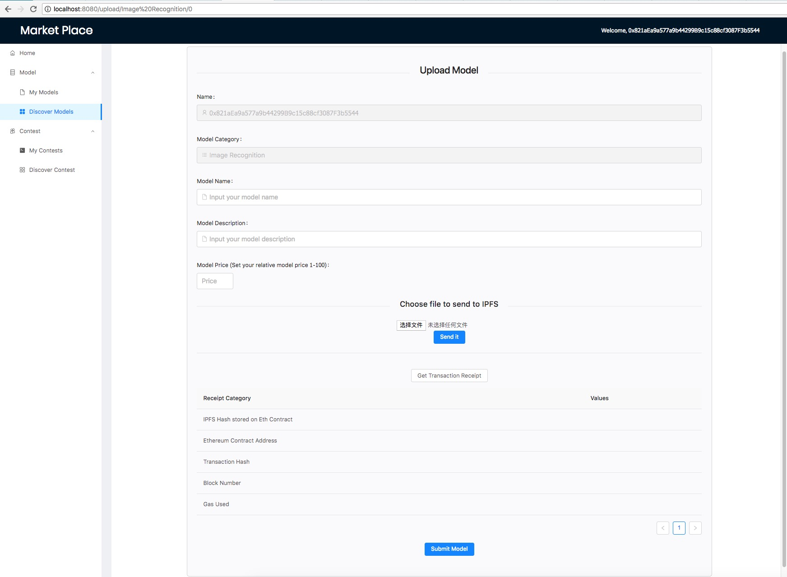
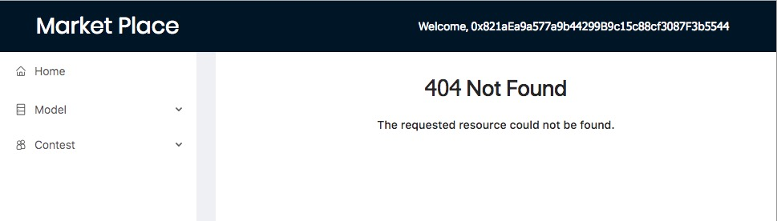

# BlockchainRevolution

  * Student Name : Chenhan Ma <br />
  * Student ID   : 823289  <br />
  * Email   : chenhanm@student.unimelb.edu.au


<br/> 
---
---
# Content
* [Project Introduction](#project-introduction)
* [Project conception](#project-conception)
* [Prerequisite](#prerequisite)
* [Installation](#installation)
* [Project Directory Introduction](#project-directory-introduction)
* [Application Page Introduction](#application-page-introduction)  


<br/> 
---
---
# Project Introduction

This project aims to build DApp on Ethereum network to help the current ML and AI processes.
Currently, it is essentially a machine learning model marketplace that 
enable users to share and improve Machine Learning Models.  

User can log into the system using MetaMask, currently the blockchain is running on Ganache localhost.
User can upload their ML model, with files uploaded to IPFS.  
Then users are able to see the model list, model detail in the model tree created.

### Project conception:
**This project has the following three ideas:**  

**1.**  Model iteration system, a ML open source community for users 
to share their ML models and iterate. Powered by a model tree data structure. ***(Implemented)***  

**2.** A Machine Learning contest system, 
user can initiate a contest with a dataset, reward and some criteria. 
Then other users can train and upload their ML models to compete for the reward. 
Similar to Kaggle Competition. ***(In Progress)***  

**3.** A Machine Learning dataset crowd sourcing platform.
Since the same ML algorithm can perform better with more data.
What if people can contribute their data into one.  ***(Future Work)***
e.g. Medical data to make diagnosis more accurate.


<br/> 
---
---
# Prerequisite  

### Ethereum dependencies  
  Note:   
  Since Ethereum development is still immature,  it is recommended to use the same version of dependencies below or higher
* Truffle v4.1.8 (core: 4.1.9)
* Solidity v0.4.24 (v0.4.22 used in smart contract)
* Ganache 1.0.2
* MetaMask 4.7.3
* Web3.js 1.0.0-beta.34

### Web dependencies
* npm 6.0.0 
* node 8.9.1
* Chrome Browser (Must use for MetaMask)
      

<br/> 
---
---
# Installation
Note: 
* Due to the nature of Ethereum project, the installation process will be a little bit complex.    


**1.**  **Make sure npm and node is installed:**  
* https://nodejs.org/en/    
* `npm -v` `node -v`

**2.**  **Install Ganache:**
* https://github.com/trufflesuite/ganache  

**3.**  **Install MetaMask:**
* https://chrome.google.com/webstore/detail/metamask/nkbihfbeogaeaoehlefnkodbefgpgknn  

**4.**  **Install Truffle:**  
* https://github.com/trufflesuite/truffle  
* http://truffleframework.com/docs/advanced/commands

```
npm install -g truffle
npm init -y
truffle init
```

**5.**  **Install solidity:**
  * http://solidity.readthedocs.io/en/v0.4.24/installing-solidity.html 
* `npm install -g solc` 

**6.**  Run `npm install` under current root directory, this will install all the packages in the `package.json`  

**7.**  **Deploy Smart Contract:**
* cd into root directory, run the following commands to compile the smart contracts:
    * `truffle compile` This will compile all the smart contract in the folder
    * `truffle migrate` This will run all the migration files to deploy contracts into `build/contract` folder  
    * Each time restart Metamask or Ganache, run this to reset all.   
```truffle migrate --reset --compile-all  ```
	
**8.**  **Open Ganache:** 
* Set Hostname to **`127.0.0.1`**, Port number to **8545**, network ID **5777**  
* Click on the key icon on any account, copy the private key

**9.**  **Open MetaMask:** 
* Set the custom RPC to address: `http://localhost:8545`, switch to it
* Click the second button on the top left, import an account using the PK
* You should be able to see 100 Ether in your MetaMask account given by Ganache

**10.** Open terminal, under the root directory, run `npm start`, this will start the web dev server

**11.** Finally, open browser, go to `localhost:8080`

**12.** **Website guide:**

* **Note**:
    * Currently IPFS can upload all kinds of files, but can't download binray files, such as `.py`.   
        So please try to upload an image for better experience.  
        Otherwise, there will be an error when trying to download the file.   
        This will be fixed in the future.   
        
* **Sample data entry guide**:        
    * Go to discover model page, click on a category, create a model. 
    * Go to my models page, click on the model just created, and create a child model
    * Try to create another model of the first model as parent.
    * Then you will be able to switch between models in the tree using the button in the model detail page.

<br/> 
---
---
# Project Directory Introduction
|Path name|Introduction|
|----|-----|
|`build/contracts`|Deployed Smart Contract json file|
|`contracts`| Smart Contract source code|
|`dist`|webpack output folder|
|`docs`|Project reports|
|`migrations`|Truffle migration files|
|`src`|Web Application source code|

<br/> 
---
---
# Application Page Introduction
|Path name|Introduction|
|----|-----|
|Home Page||
|Dicover Model marketplace page. Choose a Category.||
|Models created by current user||
|All models of a category||
|All child models of a parent model||
|Model detail page||
|Upload model page||
|404||


# Please feel free to contact me if there is any issue 

